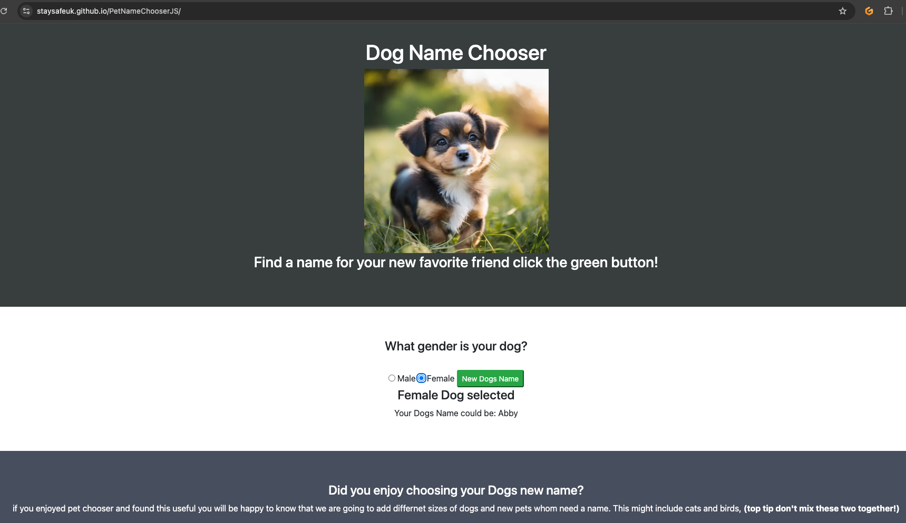

# TABLE OF CONTENTS

## 1. USER GOALS

- The users goal is to receive a new name for a potential/new dog purchase for dog(s) either male or
female.

- The users goal is to be able to select precisely male or female and select a random dog name

- The users goal is see new images of dog(s) when selecting Male and Female

- The users goal is to have new generated names for dogs clearly displayed

## 2. SITE OWNER GOALS

- The site owners goal is to have a clear concise site running JavaScript that manipulates the DOM
to produce images of dog(s) and suggest a good name for a users pet or pets.

- The site owners goal is to provide new names and some images of dogs on all devices with the correct
viewpoint, so the site is clean and displays correctly.

# 3. FEATURES

## INDEX PAGE
## Random name listing

The site has the ability to create dynamic names of dog for both sexes,  the functionality enables the
user to select a new name if they do not accept the name they are given, as many times as the names are random
from the male and female array.

## Images of correct sex of dog shown on the Web page after selection
The javascript code uses (Document Object Model) to manipulate the Web page to produce male or female images
of puppies when selecting from radio buttons.  The images are responsive and set at the correct sizes in WebP
format.

## Responsive Design
Mobile first design concept was used throughout this project,  at the UX/UI stage of design wire frame design
documents wfere used to get a clear concise page that meets the objective, This project only requires one page,
in the futu it is possible that this javascript page will be used in a further project.

# 4. UX/UI

## 1. Target Audience
- People looking to name a new pet Dog who cannot think of an appropriate name

- People whom would like to get a few ideas about a name for a dog

- People whom are too busy to think of a name or already have multiple dogs

## 2. User Stories
## Iteration 1
- USER STORY: As a user I want to be able to get a selection of names for a male or female dog(s)

- USER STORY: As a user I want to see new images of dogs when I select a name

- USER STORY: As a User I want New generated names for dogs clearly displayed

## Future Iteration
- USER STORY: As a user JS Pet Name Chooser to designed so it can be reused in the future

- USER STORY: As a user name suggestions for different sizes of dogs.

# Design choice

## Colour Scheme
- I opted for a simplistic colour scheme of Grey/Green #373E3D White #FFFFFF Green RGB(0,128, 0)
and Blue RGB(0,255,0) for social media font awesome icons.  White for text against Grey/Green
background DIVS and black text against white background.   The Button that I have used is a
success button on bootstrap 4.6.2.

## Fonts

- Due to the objective being to create a HTML page with javascript manipulating the DOM I
have decided to use default fonts.  The typeface is clear and Ill defined for the purpose of
this task.

## Banner

- Due to the objective of this task no banner is used for this web page, as the objective is
to highlight my ability to manipulate the DOM.

# 5. WIREFRAMES

The diagrams below show the wireframe layout in desktop and Mobile formats,  these wireframe diagrams
show the Website on loading the page,  if this view is required after using the Dog Name chooser
either refresh the page or reload the Website. The design will stay close to these images produced
however there might be some modifications from the original wireframe design.

## Large Screen We layout

## Mobile screen view of Website

# 6. TESTING

I ran HTML validation using the W3C Markup service and the results can be found in the link below.

## Home Page index.html

The Info trailing slash on void elements has been removed and is now resolved.

The warning for the h4 id relates to the title used for the DOM Manipulation so needs to be left
as is.

## Div Checker index.html

I ran the HTML code through https://www.aliciaramirez.com/closing-tags-checker/ and the HTML passed with no unclosed HTML tags.  see the image below for results.

## Accessibility

Accessibility has been tested with accessScan,  modifications were made to index.html including aria labels.  This is appropriate for hard of sight users. 

The Website is <b>WCAG & ADDA</b> compliant see image below

## Device Testing

I have tested the site with the following devices: 

- Google Android Pixel 7 Phone
- Xiaomi Android Redmi Phone 
- Google ChromeBook
- Apple MacBook Pro
- Apple IPad
- Chrome Developer tools (simulating for all devices)

The site functioned as designed and works well using these different device types

## Browser Testing

Testing has been completed on the following browsers:

- Google Chrome (With Developer Tools)
- Android Google Chrome
- Safari

## Tests performed

## Testing user stories

I tested my site against the following completed user stories

1. User Story: "I want to be able to get a selection of names for a male or female dog(s)."

example below of Male Dog selection selecting the name meeting the user story:

2. User Story: "As a user I want to see new images of dogs when I select a name."

User Story compliant with web page see below showing a picture of a female puppy:

3.  User Story: "New generated Name for dog clearly displayed."

Below is an image of the user story meeting it's criteria:

## JavaScript Testing

The JS code has been tested throughout the development process, using console.log before the DOM manipulation was implemented.  The Arrays response on the page has been tested in all viewpoints once the button  <i> <button onclick="submitForm()" </i> has been submitted,  The script will select a name listed in the array at random for the Radio button that is selected Male/Female.  The button and DOM output has been tested on all viewpoints.

## Bugs fixed during Development

## Radio buttons unaligned

- Radio buttons when centered in the screen were staggered vertically therefore I opted to have the radio buttons side by side which meets the criteria of being easily managed to select the sex of the dog.

## Random names from the array

- At first I had a problem where the name selections were not random from the array,  I fixed this bug by using

<i>const randomIndexMD = Math.floor(Math.random() * maleDogsArray.length);
const randomDogsMD = maleDogsArray[randomIndexMD];

const randomIndexMD = Math.floor(Math.random() * femaleDogsArray.length);
const randomDogsMD = femaleDogsArray[randomIndexMD];</i>

## Images on Website of poor quality

- I resolved this issue of poor quality images by using the webp format converter https://convertio.co/jpg-webp/

# 7. DEPLOYMENT

Site Deployment method

- This site was deployed using Github pages in Settings, Pages

- The page is deployed from the Main branch, at the top of the pages it shows
when the site is correctly deployed and displays the URL where the page can be viewed.

- Any changes to the main branch will be deployed to the main project.

# 8. SOURCES

## Media

- The three photos used in this site were generated from pixr.com and meet copyright guidelines laws as these images are AI generated none of the animals shown in these pictures are real.

## Content

- The text used in this website is original and does not come from any source therefore no copyright is required.

## Code

- The layout template was based on https://w3schools.com DIV layouts,  modified.

- Font Awesome Links 4.7.0 were used for the social media icons

- Balsamiq was used to create the Wireframe during the UI/UX design process.

# 9. FUTURE FEATURES

- IF this project goes to a future iteration I created the following:

- USER STORY: Name suggestion for different sizes of dogs -  This would include Small, Medium and Large Dog names for male and female dogs.

- Potentially in a further iteration this Dog Name Chooser could include other animals and be called Pet Name Chooser,  such animals would
include cats, rabbits, guinea pigs, fish, birds, gerbils and tortoises to name some of the top 10 pets in the UK.

# END OF README.md

